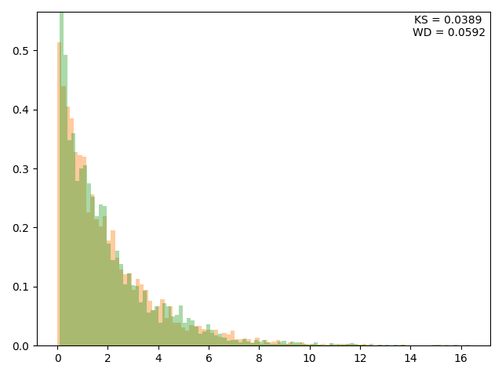

# Amortized Adaptive Importance Sampling (AAIS) for variational autoencoder
This repository provides an implementation for reproducing the results in the paper, "Amortized Adaptive Importance Sampling for variational autoencoder"

## Requirement
* python==3.11.9
* torch
* pandas
* scipy
* matplotlib
* umap
  
Their versions are unimportant because we used these packages' fundamental functions. 

## How to start
There are only two arguments: seed or datatype. 
All datasets and the associated hyperparameters had already been stored in the `config` and `data` folders, respectively. 
If you want to explore the data generation process, please check `data_generation.ipynb`, `data_generation.R`, and `GLMM.R` for `VerbAgg`.

### Example
    $ python main.py -s 1 -d exp
* `--seed` (or `-s`): Seed. `Default = 42`.
* `--dtype` (or `-d`): Datatype. Possible arguments are `exp`, `mix`, `copula`, `MNIST`, `cortex`, `VerbAgg`. `Default = exp`.

### Output

After training, the evaluation results are automatically saved. `model_states.pt` and `model_kwargs.json` are always saved. Qualitative and quantitative results are different for each experiment. 
For example, if you run with `-d exp`, `histogram.png` visualizes latent variable modeling on exp data, and `distances.json` has evaluation metrics used for the histogram.

## Customization
For customization, first prepare your data and create a config file with your desired values. 
The data should be loaded through the `dataloader.py` file, and the config file must be placed in the `config` folder. 
If the likelihood for your data is not included in `nll.py`, you need to add it yourself. 
If you want to perform an evaluation, add your custom function to `eval.py`.
Furthermore, if you want to use another architecture, define a new model class in `model.py` and integrate it appropriately with the `LatentModel` class.

